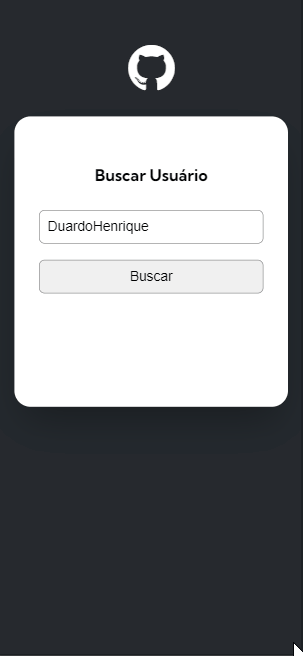

# Projeto Fetch GitHub Api

## Visualização em desktop

 
## Visualização no mobile

(Pressione CTRL + clique nas imagens para visualizar o projeto em uma nova aba)

## Linguagens utilizadas
- HTML
- CSS
- JavaScript

## Comentarios 

Projeto proposto pelo curso DevQuest, afim de consolidar alguns conceitos sobre APIs e praticar mais JavaScript.